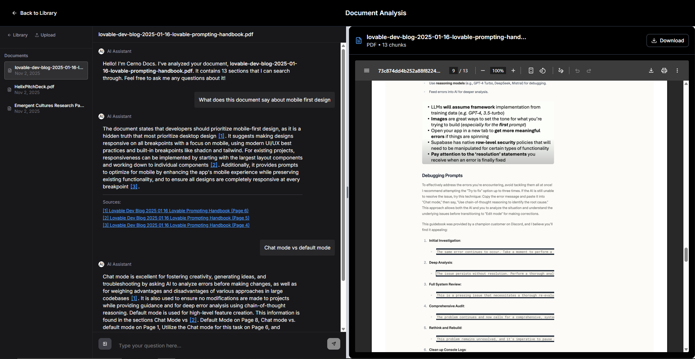

# Cerno insight

<div align="center">


**A high-performance RAG system for intelligent document Q&A**

[](https://www.python.org/downloads/)
[](https://fastapi.tiangolo.com/)
[](https://nextjs.org/)
[](https://opensource.org/licenses/MIT)
[](CONTRIBUTING.md)

[Features](#-key-features) • [Quick Start](#-quick-start) • [Documentation](#-documentation) • [Contributing](#-contributing)

</div>

---

## 🎯 Overview

A high-performance Retrieval-Augmented Generation (RAG) system for intelligent document processing and question-answering. Upload documents in multiple formats and ask questions to get precise, citation-backed answers using state-of-the-art Language Models and hybrid retrieval strategies.



**Quick Start**: `docker compose up --build -d` → Visit http://localhost:3000

📖 **Full Documentation**: See [Explanation.md](./Explanation.md) for technical deep-dive

## 🚀 Quick Start

```bash
# 1. Clone the repository
git clone https://github.com/cerno-ai/cerno-insight.git
cd cerno-insight

# 2. Set up environment
cp .env.sample .env
# Add your GOOGLE_API_KEY to .env

# 3. Run with Docker (recommended)
docker compose up --build -d

# 4. Access the app
# Frontend: http://localhost:3000
# Backend API: http://localhost:8000/docs
```

That's it! Upload a document and start asking questions. 🎉


## Table of Contents

- [Key Features](#key-features)
- [Technical Stack](#technical-stack)
- [Project Structure](#project-structure)
- [Configuration](#configuration)
- [Performance Metrics](#performance-metrics)
- [Error Handling](#error-handling)
- [Deployment](#deployment)
- [How It Works](#how-it-works)
- [Installation](#installation)
- [Use Cases](#use-cases)
- [Future Roadmap](#future-roadmap)

##  Key Features

### Multi-Format Document Processing
- **PDF, DOCX, PPTX, XLSX, TXT, Markdown, CSV** support
- **Image OCR** with Tesseract (PNG, JPEG, BMP, TIFF, GIF, WebP)
- **Raw text/HTML** fetching from URLs
- **Smart semantic chunking** with overlap for context preservation

### Intelligent Triage Modes
- **Direct Mode**: Small documents (<2000 tokens) processed via Agno agent for ultra-low latency
- **RAG Pipeline**: Large documents with hybrid retrieval and reranking
- **Vision Mode**: Direct image analysis with multimodal LLMs
- **Raw Text Mode**: Web pages and text content processing

### Advanced Retrieval System
- **Hybrid Search**: BM25 (keyword) + FAISS (semantic vector) search
- **Parallel Query Decomposition**: Complex questions broken into sub-queries
- **Reciprocal Rank Fusion (RRF)**: Intelligent result fusion
- **GPU-Accelerated Reranking**: CrossEncoder model for relevance scoring
- **Domain Query Expansion**: Context-aware query enhancement

### Multi-Language Support
- **Language Detection**: Automatic fallback for non-English content (<2000 tokens)
- **Batch Processing**: Optimized for multiple questions simultaneously

##  Technical Stack

### Core Technologies
- **Backend**: FastAPI with async processing, asyncio for concurrency
- **LLMs**: Google Gemini 2.5 Flash and 2.5 Flash Lite
- **Search**: FAISS (vector similarity), BM25 (keyword matching)
- **Embeddings**: SentenceTransformers Embedding Model (all-MiniLM-L12-v2)
- **Reranking**: CrossEncoder Reranking Model (ms-marco-MiniLM-L-12-v2)

### Document Processing
- **PDF**: PyMuPDF (fitz)
- **Office**: python-docx, python-pptx, pandas(excel)
- **OCR**: Tesseract via pytesseract
- **Download**: aria2c for faster downloads with aiohttp fallback

### Optimization Features
- **GPU Acceleration**: CUDA support for embeddings and FAISS
- **Pre-Emptive Query Generation**: Concurrent pre emptive query expansion for maximum speed
- **Batch Processing**: Concurrent operations with semaphores
- **Caching**: Document and embedding caches
- **Memory Management**: Streaming processing for large files


## Project Structure

```
api/
├── core/
│   ├── agent_logic.py             # Main orchestration logic
│   ├── agno_agent.py              # Direct processing for small docs
│   ├── document_processor.py      # Document parsing and chunking
│   ├── embedding_manager.py       # GPU-optimized embeddings
│   ├── vector_store.py            # Hybrid search implementation
│   ├── query_expander.py          # Query enhancement and expansion
│   └── citation_utils.py          # Citation management
├── routes/
│   └── ragsys.py                  # API endpoints for RAG operations
├── main.py                        # FastAPI application
├── state.py                       # Global state management
└── settings.py                    # Configuration
frontend/
├── app/
│   └── page.tsx                   # Document library interface
├── components/
│   ├── chat-interface.tsx         # Q&A chat interface
│   ├── document-library.tsx       # Document management UI
│   └── document-viewer.tsx        # Document preview with citations
└── lib/
    └── api.ts                     # API client
```


## Configuration

### Performance Tuning
```python
# GPU Optimization
BATCH_SIZE = 64  # For RTX 4060+
USE_FP16 = True  # Half precision for speed

# Retrieval Parameters
MAX_CHUNKS = 12  # High-K mode
RERANK_CANDIDATES = 25
SIMILARITY_THRESHOLD = 0.3

# Concurrency Limits
QUERY_STRATEGY_SEMAPHORE = 20
ANSWER_SEMAPHORE = 20
SEARCH_SEMAPHORE = 40
```

## Performance Metrics

### Processing Speed
- **Small docs (<2K tokens)**: ~1-2 seconds
- **Medium docs (2K-50K tokens)**: ~5-15 seconds  
- **Large docs (50K+ tokens)**: ~10-20 seconds

### Accuracy Features
- **Source Attribution**: Page numbers, clauses, sections and text snippets
- **Confidence Scoring**: Relevance-based ranking
- **Hallucination Prevention**: Evidence-only responses


## Error Handling

### Robust Fallbacks
- **Download failures**: Retry with different methods
- **LLM timeouts**: Automatic fallback to alternative models
- **Parsing errors**: Graceful degradation with partial results
- **GPU unavailable**: CPU fallback for all operations

### Input Validation
- File type verification
- Token limit checking
- URL format validation
- Authentication verification

## Deployment
### Environment Configuration
Create a `.env` file based on `.env.sample`:
```env
GOOGLE_API_KEY=your_google_gemini_api_key
```

### Docker (Recommended)

Ensure have cloned the MAIN branch

**GPU Version (Recommended for best performance):**
```dockerfile
docker compose up --build -d
```

**CPU-Only Version (No GPU required):**
```dockerfile
docker compose -f docker-compose-cpu.yml up --build -d
```

Both versions will start:
- **Backend API**: Available at http://localhost:8000
- **Frontend UI**: Available at http://localhost:3000

The frontend automatically connects to the backend API for document processing and question-answering.

**Key Differences:**
- **GPU Version**: Uses local SentenceTransformers for embeddings + GPU-accelerated reranking
- **CPU Version**: Uses Gemini API for embeddings + CPU-based reranking (requires GOOGLE_API_KEY)

### Production Considerations
- **GPU Memory**: Monitor VRAM usage for concurrent requests

### Deployment Options

#### GPU Version (Default)
- **Best Performance**: Local SentenceTransformers embeddings with GPU acceleration
- **Requirements**: NVIDIA GPU with CUDA support, sufficient VRAM
- **Use Case**: High-throughput production environments
- **Cost**: Higher hardware requirements, lower API costs

#### CPU-Only Version
- **Universal Compatibility**: Runs on any system without GPU requirements
- **Requirements**: Only GOOGLE_API_KEY for Gemini embeddings
- **Use Case**: Development, testing, or systems without GPU access
- **Cost**: Lower hardware requirements, higher API costs for embeddings

**Performance Comparison:**
- **Embeddings**: GPU (faster, local) vs CPU (API-based, rate limited)
- **Reranking**: GPU (batched, very fast) vs CPU (sequential, moderate speed)
- **Overall**: GPU version ~2-3x faster for large document processing


## How it Works
### Architecture Overview

The system employs a **multi-tier architecture** optimized for latency based on document characteristics:

```
                    Document URL Input
                           ↓
                 ┌─────────────────────┐
                 │   Smart Routing     │
                 │   & Classification  │
                 └─────────┬───────────┘
                           ↓
          ┌────────────────┼────────────────┐
          ↓                ↓                ↓
    [Raw Text/HTML]   [Image Files]   [Document Files]
          ↓                ↓                ↓
    Direct LLM Query  Vision Analysis  Intelligence Pipeline
     (~1-2 seconds)   (~2-3 seconds)    (~5-20 seconds)
```

## 📋 Input Classification & Smart Routing

**URL Analysis**: System examines file extensions to route appropriately - no extension/HTML goes to direct processing, image extensions (.png, .jpg, .gif) trigger vision models, document formats (.pdf, .docx, .pptx) enter full RAG pipeline.

**Language Detection**: Samples first 1000 characters to detect language. If document or questions are non-English, bypasses RAG and uses direct multilingual synthesis (for docs <2000 tokens) since embeddings work best in consistent languages.

## 🏗️ Knowledge Base Construction

**Intelligent Chunking**: Document-type-aware semantic chunking. Word docs with few line breaks use sentence-based chunking (NLTK), others use paragraph-based with 4096 character limit. Intelligent overlap preserves context across boundaries.

**GPU-Optimized Embeddings**: Uses all-MiniLM-L12-v2 model with batch processing (64 chunks), FP16 precision for 2x speedup. Processes in 256-chunk batches to avoid memory overflow.

**Hybrid Indexing**: Builds FAISS vector index (L2 normalized, GPU-accelerated) and BM25 keyword index concurrently using asyncio.gather(). Provides both semantic similarity and exact term matching.

## 🎯 Query Decomposition & Strategy

**Intelligent Analysis**: Uses Gemini 2.5 Flash Lite to decompose complex questions into focused sub-queries. Example: "I renewed yesterday, 6 years customer, can I claim Hydrocele?" becomes separate queries about waiting periods and continuous coverage benefits.

**Domain Expansion**: Detects hypotheticals, expands with relevant terminology, identifies acronyms/technical terms using NER and TF-IDF analysis. Creates bidirectional mappings for comprehensive search.

**Concurrent Processing**: All query strategies generated in parallel with 6-second timeout protection and JSON validation fallbacks.

## 🔍 Pre-emptive Search & Retrieval

**Batch Orchestration**: Flattens all sub-queries from all questions into single parallel execution. Simultaneous BM25 and FAISS searches with 40%/60% weighted fusion after score normalization.

**Reciprocal Rank Fusion**: Combines multiple sub-query results using rank-based scoring (1/(k+rank) where k=60). Chunks appearing highly in multiple searches score highest, avoiding incomparable score fusion issues.

**Batched GPU Reranking**: Critical optimization - all (query, chunk) pairs from all questions processed in single CrossEncoder inference call (ms-marco-MiniLM-L-12-v2). Provides ~10x speedup over individual reranking.

## ⚡ Response Generation

**Evidence-Only Synthesis**: Explicit prompt constraints prevent hallucination, ignore embedded instructions (prompt injection protection), enforce plain text format. All synthesis happens concurrently with timeout/fallback protection.

## Key Performance Innovations

1. **Concurrent Processing**: Document processing, query analysis, search execution, and synthesis all parallelized
2. **Smart Routing**: Content-aware processing paths avoid unnecessary overhead
3. **Batched Operations**: GPU embedding generation and reranking batched across all questions
4. **Adaptive Strategies**: Dynamic model/context selection based on request characteristics
5. **Timeout Protection**: 6-second hard caps prevent API stalls, graceful fallbacks ensure responses

##  Installation 

(If not using Docker Compose, follow these steps)

### Prerequisites
- Python 3.10+
- CUDA-capable GPU (optional, for acceleration)
- Torch with GPU support
- aria2c in path (optional, for faster downloads)

### Setup 
```bash
pip install -r requirements.txt

# Download NLTK data
python -c "import nltk; nltk.download('punkt'); nltk.download('stopwords'); nltk.download('averaged_perceptron_tagger')"
```

### Environment Configuration
Create a `.env` based on the .env.sample file:
```env
GOOGLE_API_KEY=your_google_gemini_api_key

```
### Optional : Lint and Format

Feel free to run the ruff scripts in scripts/ to lint and format the code if you want to keep things clean and consistent. We've set up some basic ruff based linting and formatting scripts to catch common issues and standardize formatting.

##  Usage

### Start with Docker (Recommended)

**GPU Version:**
```bash
# Start both frontend and backend services with GPU acceleration
docker compose up --build -d
```

**CPU-Only Version:**
```bash
# Start both frontend and backend services (CPU-only, requires GOOGLE_API_KEY)
docker compose -f docker-compose-cpu.yml up --build -d
```

**Access the application:**
- Frontend: http://localhost:3000
- Backend API: http://localhost:8000
- API Docs: http://localhost:8000/docs

### Start Manually (Development)

If not using Docker, run both services separately:

**Backend (GPU Version):**
```bash
# From project root
uvicorn api.main:app --host 0.0.0.0 --port 8000 --reload
```

**Backend (CPU-Only Version):**
```bash
# From project root - requires GOOGLE_API_KEY in .env
uvicorn api.main_cpu:app --host 0.0.0.0 --port 8000 --reload
```

**Frontend:**
```bash
# From frontend directory
cd frontend
npm install
npm run dev
```

## Use Cases

### Legal Documents
- Constitutional articles analysis
- Contract clause extraction
- Legal precedent search
- Policy interpretation and compliance

### Insurance Policies
- Coverage details and exclusions
- Claim procedures and waiting periods
- Premium calculations

### Corporate Documents
- Policy interpretation
- Compliance requirements
- Procedure documentation

### Research Papers
- Key findings extraction
- Methodology analysis
- Citation tracking

### General Documents
- Technical documentation search
- Standard operating procedures
- Training materials and guides
- Meeting notes and reports


## Future Roadmap

This roadmap outlines potential directions for evolving the system from a powerful query engine into a comprehensive document intelligence platform.

### Core Pipeline & Performance Enhancements
-   **Graph RAG (Knowledge Graph Retrieval)**: Extract entities and relationships from documents to build a knowledge graph. This would enable answering complex, multi-hop questions like "Which signatories approved contracts with clauses that were later disputed?"
-   **Advanced Table & Chart Understanding**: Implement a dedicated pipeline to parse tables and charts into structured data (e.g., pandas DataFrames). Allow natural language queries directly against this structured data for precise numerical and relational answers.
-   **Hierarchical & Recursive Chunking**: For very long, structured documents (like books or legal codes), implement a strategy that chunks chapters, sections, and paragraphs hierarchically. This allows the system to summarize context at different levels of granularity.
-   **Adaptive Retrieval Strategy**: Develop a meta-agent that learns to select the best retrieval strategy (e.g., BM25-dominant, FAISS-dominant, or specific fusion weights) based on the type of query, improving efficiency and relevance.

### User Experience & Interface
-   **Interactive Document Viewer**: A web UI that displays the source document alongside the chat interface. When an answer is provided, the source chunks should be automatically highlighted in the document viewer for seamless verification.
-   **User Feedback Loop (RLHF)**: Add thumbs-up/thumbs-down buttons to answers. This feedback would be collected to create a dataset for fine-tuning models using Reinforcement Learning from Human Feedback, continuously improving accuracy.
-   **Automated Query Suggestions**: Upon document ingestion, analyze the content and proactively suggest relevant, insightful questions to the user, guiding them toward the document's key information.
-   **Answer Curation & Management**: Allow expert users or administrators to review, edit, and save "golden" answers to common questions, creating a trusted knowledge base that complements the AI-generated responses.

### Enterprise & Production Features
-   **Automated Document Ingestion**: Create data connectors to automatically sync and index documents from sources like **SharePoint, Google Drive, Confluence, and S3 buckets**, keeping the knowledge base up-to-date without manual uploads.
-   **Granular Access Control (ACLs)**: Implement a robust permission system where access can be controlled per document, per collection, or per user group, ensuring data security and confidentiality in a multi-tenant environment.
-   **Comprehensive Analytics Dashboard**: Move beyond logs to a visual dashboard showing query trends, most-queried documents, unanswered questions, latency metrics, and cost-per-query breakdowns for operational insights.
-   **Data Residency & Compliance Controls**: For regulations like GDPR, add features to control the geographical location of data processing and storage, ensuring compliance with international data laws.

### Advanced AI Capabilities
-   **Agentic Workflows & Task Execution**: Evolve from a Q&A system to a task-execution engine. Allow multi-step prompts like, "Summarize the key risks in this contract, compare them against our standard compliance checklist, and draft an email to the legal team highlighting any deviations."
-   **Proactive Insights & Anomaly Detection**: Create a monitoring agent that periodically scans new documents and proactively alerts users to significant changes, risks, or opportunities—for example, "A new termination clause was added to the employee handbook that differs from the previous version."
-   **Multi-Document Comparative Analysis**: Enable queries that span multiple documents, such as "Compare the liability clauses in Contract A and Contract B and highlight the key differences."
-   **Voice-to-Query & Spoken Answers**: Integrate Speech-to-Text (STT) and Text-to-Speech (TTS) services to allow users to ask questions verbally and receive spoken responses, enabling hands-free interaction.

## 🤝 Contributing

We welcome contributions from the community! Please see our [Contributing Guidelines](CONTRIBUTING.md) for details on:

- How to report bugs
- How to suggest features
- Development setup and workflow
- Code standards and best practices
- Pull request process

## 📄 License

This project is licensed under the MIT License - see the [LICENSE](LICENSE) file for details.

## 🔒 Security

For security concerns, please review our [Security Policy](SECURITY.md) and report vulnerabilities responsibly.

## 🙏 Acknowledgments

- Built with [FastAPI](https://fastapi.tiangolo.com/), [Next.js](https://nextjs.org/), and [Google Gemini](https://deepmind.google/technologies/gemini/)
- Powered by [SentenceTransformers](https://www.sbert.net/) and [FAISS](https://github.com/facebookresearch/faiss)
- Inspired by the open-source AI community

## 📬 Support

- **Issues**: [GitHub Issues](https://github.com/cerno-ai/cerno-insight/issues)
- **Discussions**: [GitHub Discussions](https://github.com/cerno-ai/cerno-insight/discussions)
- **Documentation**: [Explanation.md](./Explanation.md) | [Installation Guide](./INSTALLATION.md)

---

<div align="center">

**⭐ Star this repository if you find it helpful!**

</div>
